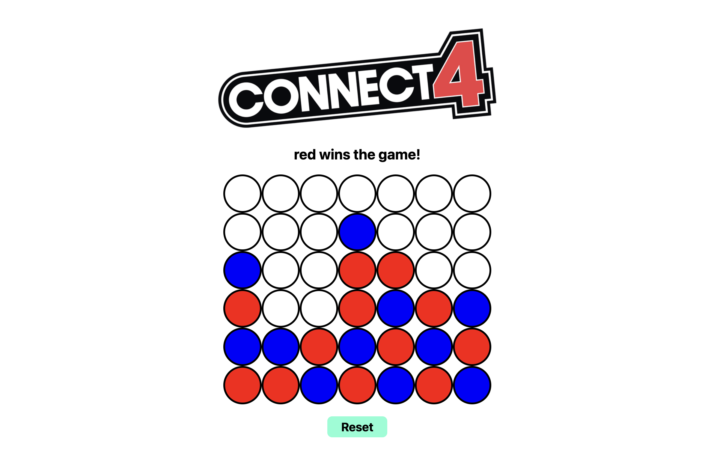

## Connect Four Game 🔴🔵

## Overview
Connect Four is a classic two-player game where players take turns dropping colored discs into a 7 column by 6 rows table.

## How the Game works
- The goal is to be the first to connect four of your circles horizontally, vertically, or diagonally.
- Each player gets a turn to place their circles into the table.
- You can only put one at a time.
- The first player to connect four circles either horizontally, vertically, or diagonally wins the game.
## Winning Combinations

The winning combinations to win the game are in order from horizontal to vertical to diagonal winning combinations:

# Gameplay

# [Connect Four](https://pc1231.github.io/CONNECT-FOUR/)

## Motivation
Motivation:
	My passion for the game is actually what inspired me to create it. My home is inhabited by a sizable family. With our parents, there were perhaps eight of us kids. Our ages were all between 18 and 4. There was only one game that permitted players of such a wide age range to interact with one another. It was a Connect Four game. There was a lot of excitement between us, whether it was beating my little sibling or my older brother. Everyone was able to take part, which made for enjoyable family time spent by all age groups.
 ### Technologies Used
- HTML
- JavaScript
- CSS
- Git and GitHub
## Planning Materials
[Planning Materials](https://docs.google.com/document/d/11jyY4j7Vdj1NDrF25JkGD28lRDYABW26yv0P4a4rJBc/edit?usp=sharing)

## To-Dos and Goals

#### To-Dos

- Customize the circles with a little more flare
- Add animation like for example when you click the blue or red circle drops into the slot like you're playing the actual game
- Add sounds when you win or tie
- Also add sound when the animation drops into place.

#### Goals

- To make the game feel just like how it is in real life.
